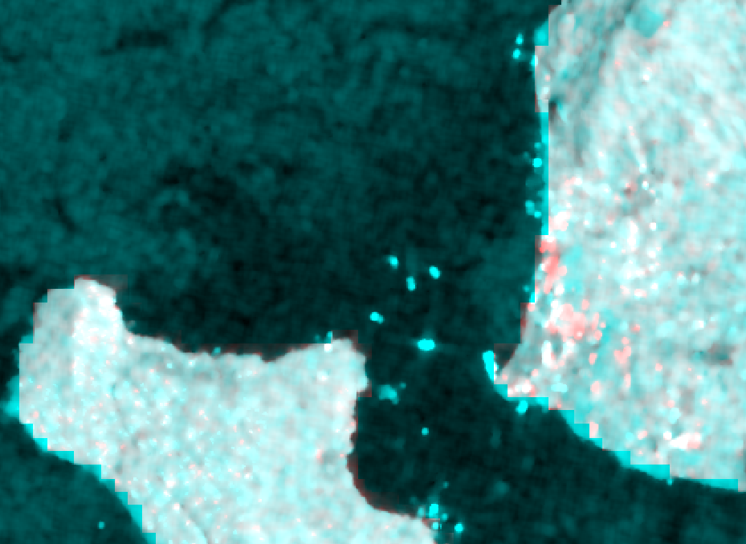

# Ream Naval Base — Sentinel-1 SAR Change Detection

Two-date C-band SAR change detection over Ream Naval Base, Cambodia (10.51°N, 103.60°E), processed in **ESA SNAP 13**. Independently corroborates the Chinese-funded pier, dry dock, and land-reclamation build-out documented in my open-source intelligence assessment of the facility.



**How to read it:** R = σ0 VV (dB) 22 Jun 2026 · G = B = σ0 VV (dB) 19 Feb 2022.
**Red** = bright radar return present only in 2026 → new hard infrastructure (reclaimed land, pier/dry-dock waterfront, support buildings). **Cyan** = returns present only at the Feb 2022 baseline (dredgers, anchored vessels, removed features). **White** = stable structures; **dark** = water.

## Why SAR

The Gulf of Thailand coast is cloud-covered much of the year, leaving gaps in optical (Sentinel-2) timelines. C-band SAR penetrates cloud, and bright, temporally stable returns discriminate hard infrastructure from transient activity — the right tool for monitoring construction at a denied-access naval facility.

## Data

| Scene | Date | Role |
|---|---|---|
| `S1A_IW_GRDH_1SDV_20220219T225359_20220219T225423_041988_050033_B688` | 19 Feb 2022 | Baseline — ~4 months pre-groundbreaking |
| `S1A_IW_GRDH_1SDV_20260622T225349_20260622T225413_065088_08343E_5D26` | 22 Jun 2026 | Recent |

Both Sentinel-1A, IW GRD-HD, **relative orbit 91, frame 557, descending** — matched imaging geometry, so radiometric change reflects ground change rather than look-angle artifacts.

## Processing chain (per scene)

1. **Subset** — geographic crop to the Ream AOI (10.40–10.66°N, 103.45–103.75°E)
2. **Apply Orbit File** — Sentinel precise orbit state vectors (auto-download)
3. **Radiometric Calibration** — DN → sigma-nought (σ0), VV + VH
4. **Speckle Filtering** — Lee Sigma, 7×7 window, σ = 0.9 (preserves point targets such as moored vessels and pier structures)
5. **Range-Doppler Terrain Correction** — SRTM 3-sec DEM, 10 m output, WGS84; sea-level masking disabled to preserve harbor pixels

Then across dates: **Collocation** of the two terrain-corrected products and an RGB composite of the dB-scaled VV bands.

## Reproduce it

The full chain is scripted as SNAP GPT graphs — no GUI required:

```bash
# per scene (run twice, once per acquisition)
gpt s1_ream_chain.xml -Pinput=/path/to/S1A_..._B688.SAFE/manifest.safe -Poutput=ream_2022_TC
gpt s1_ream_chain.xml -Pinput=/path/to/S1A_..._5D26.SAFE/manifest.safe -Poutput=ream_2026_TC

# stack the two dates
gpt s1_ream_collocate.xml -Pmaster=ream_2022_TC.dim -Pslave=ream_2026_TC.dim -Poutput=ream_change_stack
```

Scenes are free with a NASA Earthdata or Copernicus Data Space account (ASF Vertex / Copernicus Browser).

## Related work

This composite supports my broader OSINT assessment, *Chinese Naval Access and Military Infrastructure Expansion at Ream Naval Base, Cambodia*, which fuses Sentinel-1/-2 imagery analysis with corroborating reporting (CSIS/AMTI, Reuters, RFA, Nikkei Asia) into ICD 203-style analytic judgments.

---

*Contains modified Copernicus Sentinel data (2022, 2026). Analysis derived entirely from open sources.*
